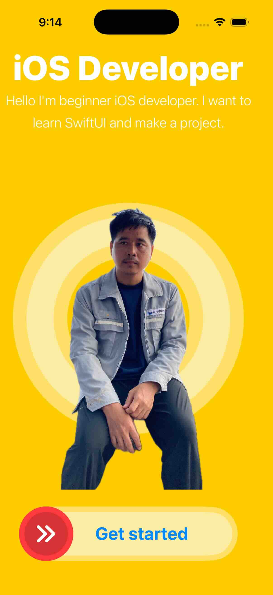

### started app
two screens for processing:
#### onboarding page
- 1) app the first started and drag get started button move to home screen
- 2) On image off screen can drag x able 

#### home page: 
- It show image similer onboarding page. we can click restart button for go to onboarding page.
- Image is animate forever 

### Image 

