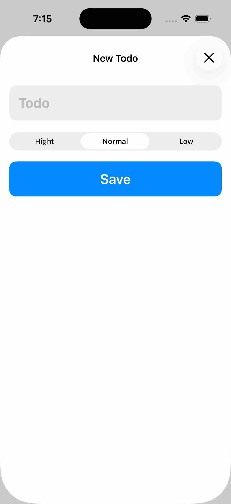
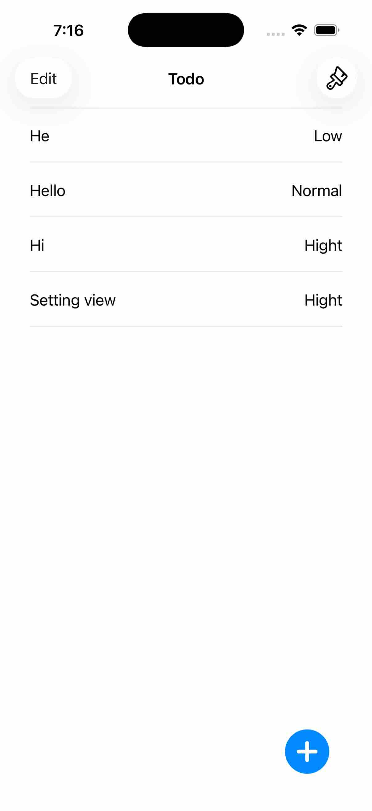
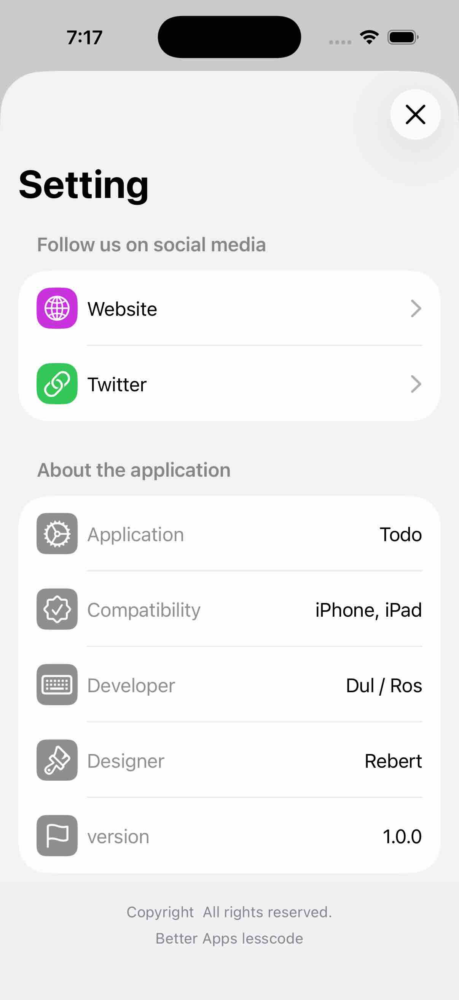

## Todo coredata
បង្កើត project ដោយយកជាមួយ coredata ។ នៅក្នុងមេរៀន coredata នេះចំនុចសំខាន់មានពីរគឺ៖

១) **@Environment**  វាមានតួនាតីធ្វើជាមួយ coredata ដោយមាន save, delete, edit ...
```swift
@Environment(\.managedObjectContext) var managerObjectContext
```
២) **@FetchRequest** និង **FetchedResults** 
```swift
@FetchRequest(entity: Todo.entity(), sortDescriptors: [NSSortDescriptor(keyPath: \Todo.name, ascending: true)])

var todos: FetchedResults<Todo>
```
or មិនសរសេរជា keyPath
```swift
@FetchRequest(entity: Todo.entity(),sortDescriptors: [NSSortDescriptor(key: "name", ascending: true)])
```
- FetchRequest: គឺជាការ fetch database
- FetchedResults: វាគឺជា responsive database បន្ទាបពី fetch 


## AddTodoViw.swift
<div>

</div>

## ContentView.swift

<div>

</div>

## SettingView.swift
<div>

</div>
