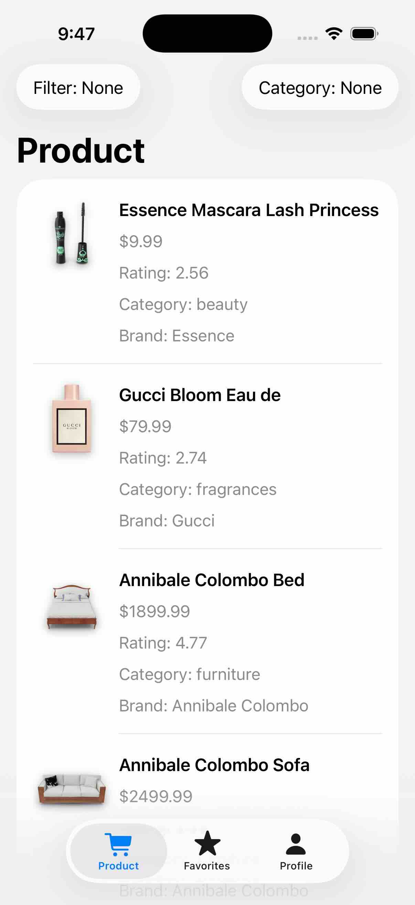
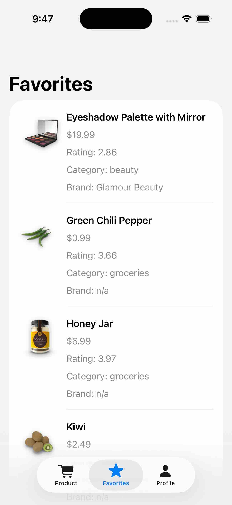

# Firebase with auth


## RootView:
```swift
struct RootView: View {
    //MARK: - PROPERTY
    @State private var showSignInView: Bool = false
    //MARK: - BODY
    var body: some View {
        ZStack{
            NavigationStack{
                SettingView(showSignInView: $showSignInView)
            }
            .onAppear{
                let authUser = try? AuthenticationManager.shared.getAuthenticateUser()
                self.$showSignInView.wrappedValue = authUser == nil
            }
            
            .fullScreenCover(isPresented: $showSignInView){
                NavigationStack {
                    AuthenticationView(showSignInView: $showSignInView)
                }
            }//: FULLSCREENCOVER
        }//: ZSTACK
    }
}
```
- **NavigationStack** ប្រសិនជា showSignInView គឺ false ត្រូវបានដំណើរការនៃ SettingView()
- **fullScreenCover** វាដូចទៅនឹង .sheet() ដែរដំណើរការនៅពេល showSignInView គឺ true វាគឺដំណើរការ  AuthenticationView()
- **onAppear** វាជា logic ដើម្បីផ្លាស់ប្តូរ showSignInView ថា false ឬក៏ true 


# Email and Password processing:
## 1) AuthenticationView.swift
-> Click Logn In Button -> Form Input emaii & password
```swift
import SwiftUI
struct AuthenticationView: View {
    //MARK: - PROPERTY
    @Binding var showSignInView: Bool
    //MARK: - BODY
    var body: some View {
        VStack {
            NavigationLink{
                SignInEmailView( showSignInView: $showSignInView)
            }label: {
                Text("Sign In With Email")
                    .font(.headline)
                    .frame(height: 55)
                    .frame(maxWidth: .infinity)
                    .foregroundColor(.white)
                    .background(Color.blue.cornerRadius(10))
            }
            .padding()
            .navigationTitle("Sign In")
            
            Spacer()
        } 
    }
}

//MARK: - PREVIEW
#Preview {
    NavigationStack{
        AuthenticationView(showSignInView: .constant(false))
    }
}
```
## 2) SignInEmailView.swift
Affter click Logn In Button
```swift
import SwiftUI
internal import Combine

@MainActor
final class SignInEmailModel: ObservableObject{
    @Published var email = ""
    @Published var password = ""
    
    func signUp() async throws{
        guard !email.isEmpty, !password.isEmpty else {
            print("No email or password found!")
            return
        }
        let _ = try await AuthenticationManager.shared.creatUser(email: email, password: password)
        
    }//: SignUp
    
    func signIn() async throws{
        guard !email.isEmpty, !password.isEmpty else {
            print("No email or password found!")
            return
        }
        let _ = try await AuthenticationManager.shared.signInUser(email: email, password: password)
        
    }//: SignIn
}

struct SignInEmailView: View {
    //MARK: - PROPERTY
    @StateObject var vm = SignInEmailModel()
    @Binding var showSignInView: Bool
    
    //MARK: - BODY
    var body: some View {
        VStack {
            TextField("Email...", text: $vm.email)
                .padding()
                .background(.gray.opacity(0.4))
                .cornerRadius(10)
            
            SecureField("Password...", text: $vm.password)
                .padding()
                .background(.gray.opacity(0.4))
                .cornerRadius(10)
            
            Button {
                Task{
                    do {
                        try await vm.signUp()
                        showSignInView = false // dismiss SignInEmailView
                    }catch{
                        print("Error signing in: \(error)")
                    }
                    
                    do {
                       try await vm.signIn()
                        showSignInView = false // dismiss SignInEmailView
                    }catch{
                        print("Error signing in: \(error)")
                    }
                    
                }
            } label: {
                Text("Sign In")
                    .font(.headline)
                    .frame(height: 55)
                    .frame(maxWidth: .infinity)
                    .foregroundColor(.white)
                    .background(Color.blue.cornerRadius(10))
            }

            Spacer()
        }//: VSTACK
        .padding()
        .navigationTitle("Sign In With Email")
    }
}

#Preview {
    NavigationStack{
        SignInEmailView( showSignInView: .constant(false))
    }
    
}

```
## 3) AuthenticationManager.swift
Logical of class 
```swift
import SwiftUI
import FirebaseAuth

struct AuthDataResultModel {
    var uid: String
    var email: String?
    var photoURL: String?
    
    init(user: User) {
        self.uid = user.uid
        self.email = user.email
        self.photoURL = user.photoURL?.absoluteString
    }
    
}

class AuthenticationManager {
    static let shared = AuthenticationManager()
    private init(){}
    
    func getAuthenticateUser() throws -> AuthDataResultModel {
        guard let user = Auth.auth().currentUser else {
            throw URLError(.badServerResponse)
        }
        return AuthDataResultModel(user: user)
    }
    
    @discardableResult
    func creatUser(email: String, password: String) async throws -> AuthDataResultModel {
        let authDtaResult =  try await Auth.auth().createUser(withEmail: email, password: password)
        return AuthDataResultModel(user: authDtaResult.user)
    }
    
    @discardableResult
    func signInUser(email: String, password: String) async throws -> AuthDataResultModel{
        let authDtaResult =  try await Auth.auth().signIn(withEmail: email, password: password)
        return AuthDataResultModel(user: authDtaResult.user)
    }
    
    func resetPassword(password: String) async throws{
        try await Auth.auth().sendPasswordReset(withEmail: password)
    }
    
    func updatePassword(password: String) async throws{
        guard let user = Auth.auth().currentUser else {
            throw URLError(.badServerResponse)
        }
        try await user.updatePassword(to: password)
    }
    
    func updateEmail(email: String) async throws {
        guard let user = Auth.auth().currentUser else {
            throw URLError(.badServerResponse)
        }
        try await user.sendEmailVerification(beforeUpdatingEmail: email)
    }
    
    func sigOut()throws{
        try Auth.auth().signOut()
    }
}
```


### NavigationStack នៅ preview live
នៅចំនុច preview យើងដាក់ NavigationStack

View នោះមាន NavigationLink ឬត្រូវការក្នុង context navigation → ត្រូវ wrap វា ក្នុង NavigationStack ដើម្បី preview behavior ត្រឹមត្រូវ។

បើគ្មាន NavigationStack, preview នឹងមិនមាន navigation environment → NavigationLink មិនដំណើរការ។

# Google 
1) **Firebase Configuration**: 
Enabling Google as a sign-in provider in the Firebase console and configuring the project-level settings.

2) **Installing the SDK**: Adding the GoogleSignIn SDK via Swift Package Manager.

3) **URL Scheme Setup**: Configuring the URL Types in Xcode using the reversed client ID from the GoogleService-Info.plist.

4) **Implementing the Button**: Using the native GoogleSignInButton for compliance with Google's UI guidelines.

5) **Handling Auth Logic**: Extracting the ID token and access token from the Google result to pass to Firebase.

## With google sign in

### សង្ខេបដំណើរការ Sign in ជាមួយ Google ក្នុង AuthenticationView.swift

ខាងក្រោមនេះជាដំណើរការសំខាន់ៗរបស់ការចូលប្រើ (login) ជាមួយ Google ហើយជា flow ទាំងមូល។

1) **ViewModel** ទទួលខុសត្រូវធ្វើ Sign-In
ក្នុង AuthentcationViewModel មានមុខងារ signIn() ដែលធ្វើការ sign-in ជាមួយ Google៖

• បង្កើត SignInGoogleHelper() ដែលជាអ្នកជួយ (helper) ដើម្បីដោះស្រាយ UI និង token flow របស់ Google Sign-In។

• ហៅ try await helper.signIn() ដើម្បីបើក Google sign-in flow (UI Google), ហើយទទួលបាន tokens (សម្រាប់ធម្មតា idToken និង accessToken) បន្ទាប់ពីអ្នកប្រើបានអនុញ្ញាត។

• បន្ទាប់មក ផ្ញើ tokens ទៅ AuthenticationManager.shared.signinWithGoogle(tokens: tokens) ដើម្បីបង្កើត/ផ្ទៀងផ្ទាត់ session ជាមួយ Firebase Auth។

ចំណុចសំខាន់: AuthenticationManager ជា layer ដែលភ្ជាប់ទៅ FirebaseAuth ដើម្បីបម្លែង Google tokens ទៅជា Firebase credential ហើយ sign-in ទៅក្នុង Firebase។

2) **View** ប្រើ GoogleSignInButton ហៅទៅ ViewModel
ក្នុង AuthenticationView:

• មាន 
```swift
@StateObject private var viewModel = AuthentcationViewModel() 
```
ដើម្បីគ្រប់គ្រង state sign-in។

• នៅពេលចុច GoogleSignInButton, វាធ្វើ Task { try await viewModel.signIn() }:

   • ប្រសិនបើជោគជ័យ showSignInView = false ដើម្បីបិទ/ចាកចេញពីទំព័រ sign-in។

   • ប្រសិនបើបរាជ័យ វា print កំហុសតាម console។

3) AuthenticationManager ធ្វើការជាមួយ Firebase
ទោះបីជា AuthenticationManager មិនបង្ហាញក្នុងឯកសារនេះក៏ដោយ តាមទម្លាប់៖

• វានឹងទទួល idToken និង accessToken ពី Google។

• បង្កើត AuthCredential របស់ Firebase (ជាធម្មតា GoogleAuthProvider.credential(withIDToken:accessToken:))។

• ហៅ Auth.auth().signIn(with: credential) ដើម្បី sign-in ទៅ Firebase។

• បន្ទាប់ពីជោគជ័យ អ្នកប្រើនឹងមាន Firebase user session ដែលអាចប្រើទិន្នន័យ authenticated នៅក្នុង app។


## Setup user at firestore
### userManager

<details><summary> Show more.. </summary>

```swift
import Foundation
import FirebaseFirestore
import FirebaseAuth
import FirebaseCore
import FirebaseSharedSwift


struct DBUser: Codable {
    let userId: String
    let email: String?
    let photoURL: String?
    let dateCreated: Date?
}

final class UserManager{
    static let shared = UserManager()
    private init(){}
    
    private let userCollection = Firestore.firestore().collection("users")
    
    private func userDocument(userId: String) -> DocumentReference{
        userCollection.document(userId)
    }
    
    func createNewUser(auth: AuthDataResultModel) async throws {
        var userData:[String: Any] = [
            "user_id": auth.uid,
            "date_created": Timestamp()
        ]
        
        if let email = auth.email {
            userData["email"] = email
        }
        if let photoURL = auth.photoURL {
            userData["photo_url"] = photoURL
        }
        
        try await userDocument(userId: auth.uid).setData(userData, merge: false)
        
    }
    
    func getUser(useId: String) async throws -> DBUser {
        let snapshot =  try await userDocument(userId: useId).getDocument()
        
        guard let data = snapshot.data() else {
            throw URLError(.badServerResponse)
        }
        
        let userId = data["user_id"] as? String
        let email = data["email"] as? String
        let photoURL = data["photo_url"] as? String
        let createdAt = data["date_created"] as? Date
        
       return DBUser(userId: useId, email: email, photoURL: photoURL, dateCreated: createdAt)
    }
    
    
}
```
### subview/AuthentcationViewModel

```swift
import Foundation
internal import Combine

@MainActor
final class AuthentcationViewModel: ObservableObject{
    
    func signIn() async throws{
        let helper = SignInGoogleHelper()
        let tokens = try await helper.signIn()
        let authDataResult = try await AuthenticationManager.shared.signinWithGoogle(tokens: tokens)
        let user = DBUser.init(userId: authDataResult.uid,
                               email: authDataResult.email,
                               photoURL: authDataResult.photoURL,
                               dateCreated: Date())

        try await UserManager.shared.createNewUser(user: user)
           
    } 
}

```
</details>

# Fetch Data and Upload to firestore
## Fetch Data

<details><summary>Show more..</summary>

### បង្កើត type ទៅតាម api
**/utilities/ProductDatabase**

```swift
struct ProductArray: Codable {
    let products: [Product]
    let total, skip, limit: Int
}

struct Product: Identifiable, Codable, Equatable {
    let id: Int
    let title: String?
    let description: String?
    let price: Double?
    let discountPercentage: Double?
    let rating: Double?
    let stock: Int?
    let brand, category: String?
    let thumbnail: String?
    let images: [String]?
    
    enum CodingKeys: String, CodingKey {
        case id
        case title
        case description
        case price
        case discountPercentage
        case rating
        case stock
        case brand
        case category
        case thumbnail
        case images
    }
    
    static func ==(lhs: Product, rhs: Product) -> Bool {
        return lhs.id == rhs.id
    }
    
}
```
### fetch api
**/core/Product/ProductView**
```swift
import SwiftUI
internal import Combine

@MainActor
final class ProductViewModel: ObservableObject {
    
    func downloadProductAndUploadToFirebase(){
        guard let url = URL(string: "https://dummyjson.com/products")else{return}
        
        Task{
            do{
                let request = URLRequest(url: url)
                let (data, response) = try await URLSession.shared.data(for: request)
                let products = try JSONDecoder().decode(ProductArray.self, from: data)
                
                print("SUCCESS")
                print(products.products.count)
            }catch{
                print(error)
            }
        }
        
    }
}

struct ProductView: View {
    @StateObject private var viewModel = ProductViewModel()
    var body: some View {
        ZStack{
            Text(/*@START_MENU_TOKEN@*/"Hello, World!"/*@END_MENU_TOKEN@*/)
        }
        .navigationTitle("Product")
        .onAppear{
            viewModel.downloadProductAndUploadToFirebase()
        }
        
    }
}
```
យើង run វារួចហើយប្រសិនជាវាចេញថា Success នោះពិតជាដំណើរការល្អ។

### Upload product to firebase
**/core/Firebase/ProductManager**
```swift
import Foundation
import FirebaseFirestore
import Firebase


final class ProductManager {
    static let share = ProductManager()
    private init(){}
    
    private let productCollection = Firestore.firestore().collection("products")
    
    private func productDocument(productId: String) -> DocumentReference {
        productCollection.document(productId)
    }
    
    func uploadProduct(product: Product) async throws{
        try productDocument(productId: String(product.id)).setData(from: product, merge: false)
    }    
}
```
ចំនែក ProductView របស់យើងបន្ថែបកូនបន្ទិចទៀត៖

**/core/Product/ProductView**
```swift
...
final class ProductViewModel: ObservableObject {
    
    func downloadProductAndUploadToFirebase(){
        guard let url = URL(string: "https://dummyjson.com/products")else{return}
        
        Task{
            do{
                let request = URLRequest(url: url)
                let (data, _) = try await URLSession.shared.data(for: request)
                let products = try JSONDecoder().decode(ProductArray.self, from: data)
                
                let productArray = products.products
                
                for product in productArray{
                    try await ProductManager.share.uploadProduct(product: product)
                
                }
                
                print("SUCCESS")
                print(products.products.count)
            }catch{
                print(error)
            }
        }
        
    }
}
.....

```
ប្រសិនជាចេញ success នោះវាដំណើរការហើយ

</details>

## Favorite page
<details><summary>Show code</summary>

```swift
import SwiftUI
import Combine

final class FavouriteViewModel: ObservableObject{
    @Published private(set) var products: [(userFavouriteProduct: UserFavouriteProduct, product: Product)] = []
    @Published var isLoading = false
    
    func getFavorites(){
        guard !isLoading else{ return}
        isLoading = true
           
        Task{
            let authResult = try AuthenticationManager.shared.getAuthenticateUser()
            
            let userFavoriteProducts = try await UserManager
                .shared.getUserAllFavoriteProduct(userId: authResult.uid.self)
            
            var localArray: [(userFavouriteProduct: UserFavouriteProduct, product: Product)] = []
            
            for userFavoriteProduct in userFavoriteProducts {
                
                if let product = try? await ProductManager.shared.getProduct(productId: String(userFavoriteProduct.productId)){
                   localArray.append((userFavoriteProduct, product))
                    
                    isLoading = false
               }
            }
            self.products = localArray
        }
        
    }
    
    func removeFavoriteProduct(favoriteId: String){
        guard !isLoading else {return}
        isLoading = true
        Task{
            let authResult = try AuthenticationManager.shared.getAuthenticateUser()
            try await UserManager.shared.removeUserFavoriteProduct(userId: authResult.uid, favoriteId: favoriteId)
            
            getFavorites()
            isLoading = false
        }
    }
    
}

struct FavoriteView: View {
    //MARK: - Property
    @StateObject private var viewModel = FavouriteViewModel()
    
    //MARK: - Body
    var body: some View {
        
        List{
            ForEach(viewModel.products, id: \.userFavouriteProduct.id.self) { item in
                ProductCellView(product: item.product)
                    .contextMenu {
                        Button("Remove from favorite"){
                            viewModel.removeFavoriteProduct(favoriteId: String(item.userFavouriteProduct.id))
                        }
                    }
                
                    
            }// - forEach

        }// - List
        .navigationTitle("Favorites")
        .onAppear{
            viewModel.getFavorites()
        }
        
        if viewModel.isLoading{
            HStack{
                Spacer()
                ProgressView()
                Spacer()
            }
            .padding()
        }
    }
}

```
</details>

# screenshots

<div style="display: flex; gap: 10px">
    
    
</div>