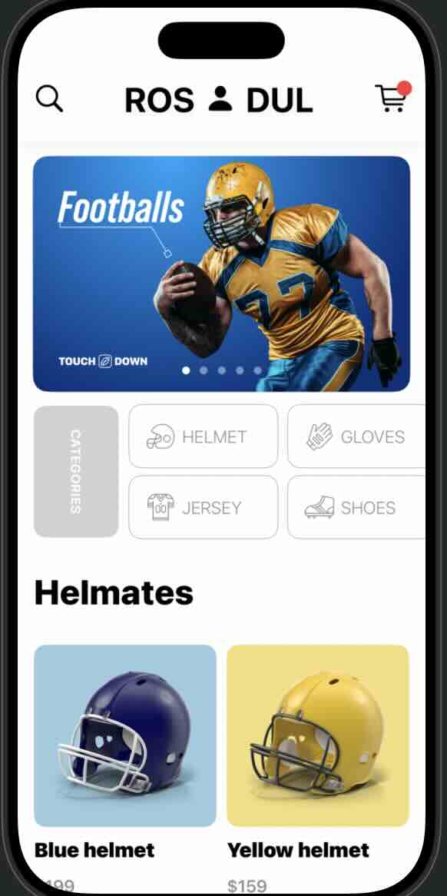
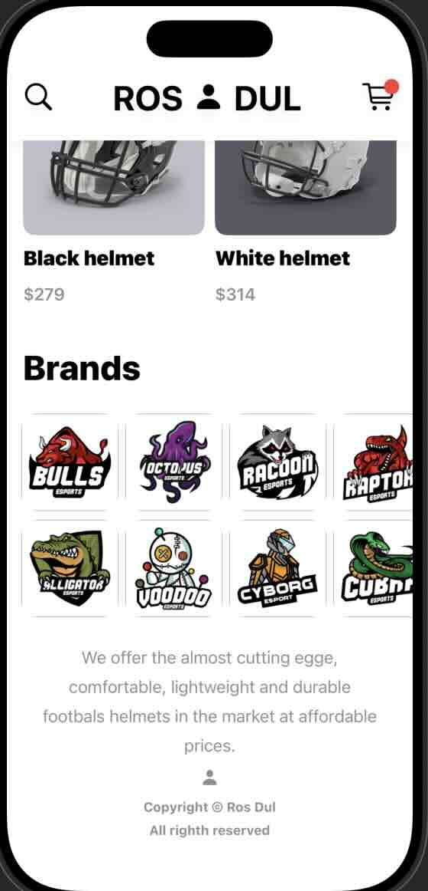
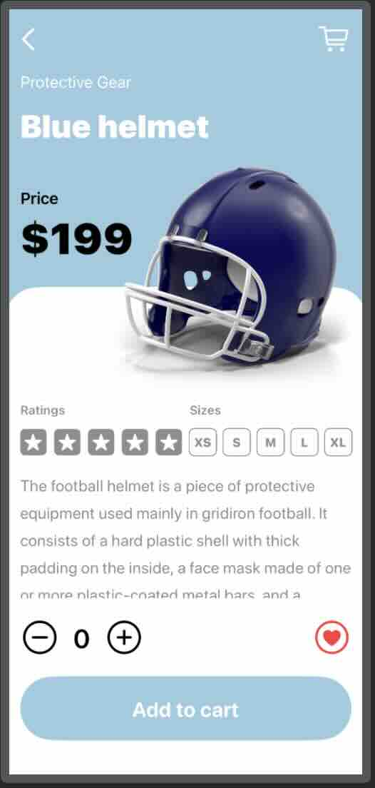

## Touch Down
## 1) រៀបចំ Folder Structure:
```tree
.
├── App/            # Main Page
├── Views/          # Folder for subview of page    
├── Models/         # DataType of json or api
├── ViewModels/     # Logical    
├── Utilities/      # Constant   
├── Data/           # Data Json
├── Extension/      # extension Bundle of class      

```
## 2) Home Page:

<div style="display: flex; gap: 10px">


</div>

####  About Files
```tree
├── App/
│   ├── ContentView.swift
├── Views/Home/
│   ├── NavigationBarView.swift     
│   ├── LogoView.swift
│   ├── FooterView.swift
│   ├── FeaturedItemView.swift
│   ├── FeaturedTabView.swift
│   ├── CategoryItemView.swift
│   ├── CategoryGridView.swift
│   ├── SectionView.swift
│   ├── TitleView.swift
│   ├── BrandItemView.swift
│   └── BrandGridView.swift
├── Models/
│   ├── PlayerModel.swift
│   ├── CategoryModel.swift
│   ├── ProductModel.swift
│   └── BrandModel.swift
├── ViewModels/    
├── Utilities/ 
│   └── Constant.swift
├── Data/
│   ├── brand.json
│   ├── category.json
│   ├── player.json
│   └── product.json
├── Extension/ 
│   └── CodableBundleExtension.swift
└── ...
```


## 3) Product Detail View
/App/ProductDetailtView : គឺស្រាប់បង្ហាញនៃ views តូចៗបានទាក់ទាងគ្នាង។ ដែលវាមាន file ដូចជា៖ <br/>
<div style="display: flex; gap: 10">


<p style="padding-left: 10px">

```js
- constant.swift
- /Detail/NavigationBarDetailView.swift
- /Detail/HeaderDetailView.swift
- /Detail/TopPathDetailView.swift
- /Utilities/CustomShape.swift
- /Detail/RatingSizeDetailView.swift
- /Detail/QuantityFavouriteDetailView.swift
- /Detail/AddToCartDetailView.swift
```
</p>
</div>

1) NavigationBarDetailView វាគឺប្រើ navigationbar និង cart ។

2) HeaderDetailView សម្រាប់បង្ហាញអក្សរនៃចំណងជើង ដូចក្នុងរូពភាពគឺ Blue Helmet ។

3) TopPathDetailView គឺជាការបង្ហាញតំលៃ និងរូបភាព ។

4) CustomShape.swift គឺប្រើសម្រាប់បន្ថែម shape ខាងលើនៃ background អក្សរដែលមាន roundedRect ។ បន្ទាបមកហៅចូលមកប្រើនៅក្នុង ProductDetailtView នៅក្នុងចំណុច Text() ដែលប្រើ modifier clipShape
()។

5) RatingSizeDetailView វាសម្រាប់ការធ្វើ start rate និងការជ្រើសរើស size ។

6) QuantityFavouriteDetailView គឺផ្នែកប៊ូតុនសម្រាប់ចុចយកចំនួន និង heart សម្រាបថាចូលចិត្ត។

7) AddToCartDetailView ជាផ្នែកប៊ូតុនសម្រាប់ add វាចូលក្នុង cart ។