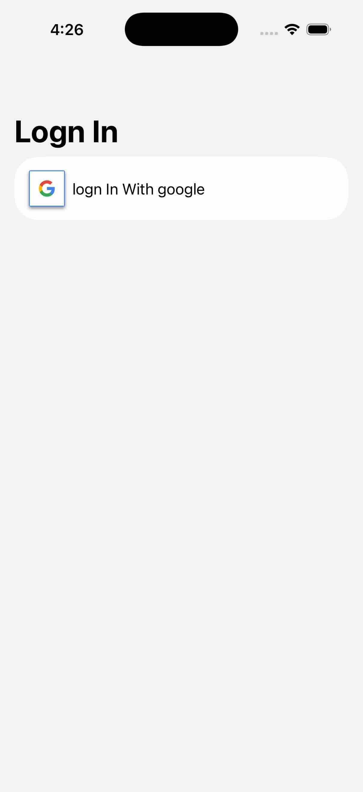
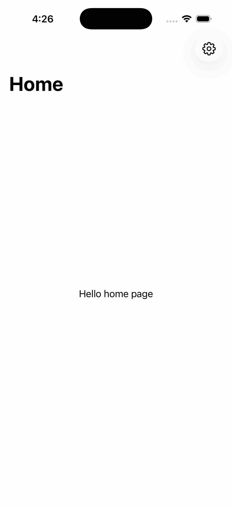

# ដំណើរការជាជំហានៗ (៣ ជំហានធំៗ)
ដើម្បីឲ្យងាយចាំ ឲ្យតែធ្វើ Auth ជាមួយ Firebase និង Third-party (ដូចជា Google, Apple, Facebook) គឺវាដើរតាម ៣ ជំហាននេះជានិច្ច៖

## ជំហានទី ១៖ 
ទៅសុំសំបុត្រពី Google (Get Token from Google)
- សកម្មភាព៖ App របស់អ្នកបើកផ្ទាំង Google ឲ្យអ្នកប្រើប្រាស់វាយ Email/Password។

- លទ្ធផល៖ នៅពេលអ្នកប្រើប្រាស់វាយត្រូវ Google នឹងហុច "សំបុត្រស្នងការ" មួយច្បាប់មកឲ្យ App របស់អ្នកវិញ (ក្នុងកូដយើងហៅវាថា idToken និង accessToken)។

- ជំហាននេះ Firebase មិនទាន់ដឹងលឺអ្វីទាំងអស់។

## ជំហានទី ២៖ 
ធ្វើលិខិតឆ្លងដែនទៅ Firebase (Create Firebase Credential)
- សកម្មភាព៖ បន្ទាប់ពី App របស់អ្នកបានសំបុត្រពី Google ហើយ វានឹងយកសំបុត្រនោះទៅខ្ចប់បញ្ចូលគ្នា ដើម្បីបំប្លែងទៅជាទម្រង់មួយដែល Firebase ស្គាល់។

- លទ្ធផល៖ នៅក្នុងកូដ យើងហៅវាថា AuthCredential (ដូចជាកូដ៖ GoogleAuthProvider.credential(...))។ វាប្រៀបដូចជាការយកសំបុត្រធម្មតាទៅដូរយកលិខិតឆ្លងដែនផ្លូវការ។

## ជំហានទី ៣៖ 
ចូលទ្វារ Firebase (Sign In to Firebase)

- សកម្មភាព៖ App របស់អ្នកយក AuthCredential (លិខិតឆ្លងដែន) នោះ ទៅยื่นជូន Firebase Auth។

- លទ្ធផល៖ Firebase ពិនិត្យឃើញថាត្រឹមត្រូវ វានឹងបង្កើតគណនីថ្មីមួយឲ្យអ្នកប្រើប្រាស់នោះនៅក្នុង Firebase Console រួចត្រឡប់ទិន្នន័យមកវិញ (AuthDataResult)។ មកដល់ជំហាននេះគឺជោគជ័យ ១០០%។

# RootView
## ដំណើរការពេល App ចាប់ផ្តើមបើក (.onAppear)៖

### ករណីទី ១៖ បើអ្នកមិនទាន់បាន Login ទេ (authUser == nil)
1- ក្នុង .onAppear កូដរបស់អ្នកគណនា៖ authUser == nil គឺពិត (True)។

2- វាកំណត់តម្លៃឲ្យ showLoginScreen = true។

3- ពេល showLoginScreen ឡើង true ភ្លាម មុខងារ .fullScreenCover នឹងដឹងខ្លួន ហើយលោតផ្ទាំង AuthenticationView មកបាំងពីលើពេញអេក្រង់ភ្លាមៗ។ ឯនៅក្នុង ZStack ដោយសារវាជាប់លក្ខខណ្ឌ if !showLoginScreen (មិនមែន true គឺ false) វានឹងមិនបង្ហាញ TabbarView នៅខាងក្រោមឡើយ។ (ត្រឹមត្រូវ ១០០%)

### ករណីទី ២៖ បើអ្នកបាន Login រួចរាល់ហើយ (authUser មានទិន្នន័យ)
1- ក្នុង .onAppear កូដបានគណនា៖ authUser == nil គឺមិនពិត (False)។

2- វាកំណត់តម្លៃឲ្យ showLoginScreen = false។

3- ពេល showLoginScreen ស្មើ false មុខងារ .fullScreenCover នឹងមិនដំណើរការឡើយ (មិនបើកផ្ទាំង Login ទេ)។

4- ប៉ុន្តែនៅក្នុង ZStack វិញ វាចូលលក្ខខណ្ឌ if !showLoginScreen (មិនមែន false គឺ true) វានឹងបើកបង្ហាញ TabbarView ឲ្យអ្នកប្រើប្រាស់ចូលទៅលេងក្នុង App ភ្លាមៗ។ (ត្រឹមត្រូវ ១០០%)

# Image 

    
    

